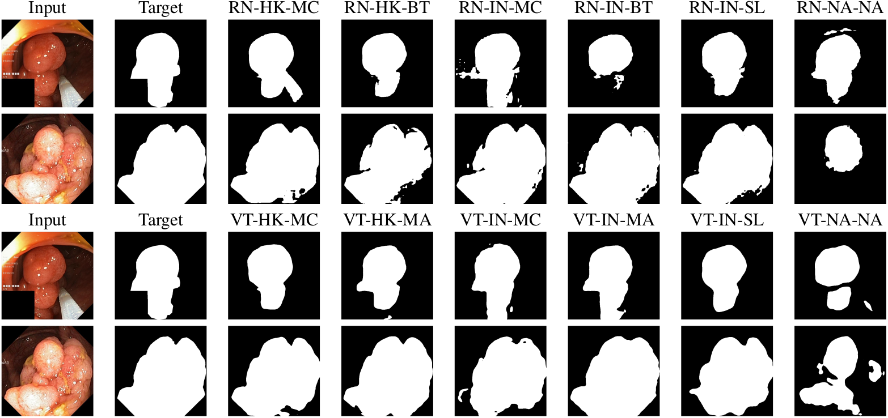

# SSL4GIE
Official code repository for: A Study on Self-Supervised Pretraining for Vision Problems in Gastrointestinal Endoscopy

Authors: [Edward Sanderson](https://scholar.google.com/citations?user=ea4c7r0AAAAJ&hl=en&oi=ao) and [Bogdan J. Matuszewski](https://scholar.google.co.uk/citations?user=QlUO_oAAAAAJ&hl=en)

Links to the paper:
+ [arXiv](https://arxiv.org/abs/2401.06278)

## 1. Abstract

Solutions to vision tasks in gastrointestinal endoscopy (GIE) conventionally use image encoders pretrained in a supervised manner with ImageNet-1k as backbones. However, the use of modern self-supervised pretraining algorithms and a recent dataset of 100k unlabelled GIE images (Hyperkvasir-unlabelled) may allow for improvements. In this work, we study the finetuned performance of models with ResNet50 and ViT-B backbones pretrained in self-supervised and supervised manners with ImageNet-1k and Hyperkvasir-unlabelled (self-supervised only) in a range of GIE vision tasks. In addition to identifying the most suitable pretraining pipeline and backbone architecture for each task, out of those considered, our results suggest: that self-supervised pretraining generally produces more suitable backbones for GIE vision tasks than supervised pretraining; that self-supervised pretraining with ImageNet-1k is typically more suitable than pretraining with Hyperkvasir-unlabelled, with the notable exception of monocular depth estimation in colonoscopy; and that ViT-Bs are more suitable in polyp segmentation and monocular depth estimation in colonoscopy, ResNet50s are more suitable in polyp detection, and both architectures perform similarly in anatomical landmark recognition and pathological finding characterisation. We hope this work draws attention to the complexity of pretraining for GIE vision tasks, informs this development of more suitable approaches than the convention, and inspires further research on this topic to help advance this development.

## 2. Example predictions from models trained using this codebase

<p align="center">
	 <br />
	<em>
		Figure 2: Targets (yellow bounding boxes) and predictions (green bounding boxes), for models finetuned for object detection using Kvasir-SEG, for two randomly selected instances of the Kvasir-SEG test set. For conciseness, we denote ResNet50s with RN, ViT-Bs with VT, pretraining with Hyperkvasir-unlabelled with HK, pretraining with ImageNet-1k with IN, MoCo v3 pretraining with MC, Barlow Twins pretraining with BT, MAE pretraining with MA, supervised pretraining with SL, and no pretraining with NA-NA.
	</em>
</p>

<p align="center">
	 <br />
	<em>
		Figure 3: Targets and predictions, for models finetuned for semantic segmentation using Kvasir-SEG, for two randomly selected instances of the Kvasir-SEG test set. For conciseness, we denote ResNet50s with RN, ViT-Bs with VT, pretraining with Hyperkvasir-unlabelled with HK, pretraining with ImageNet-1k with IN, MoCo v3 pretraining with MC, Barlow Twins pretraining with BT, MAE pretraining with MA, supervised pretraining with SL, and no pretraining with NA-NA.
	</em>
</p>
<p align="center">
	 <br />
	<em>
		Figure 4: Targets and post-processed predictions, for models finetuned for monocular depth estimation using C3VD, for a randomly selected instance from each of the test videos for C3VD. For conciseness, we denote ResNet50s with RN, ViT-Bs with VT, pretraining with Hyperkvasir-unlabelled with HK, pretraining with ImageNet-1k with IN, MoCo v3 pretraining with MC, Barlow Twins pretraining with BT, MAE pretraining with MA, supervised pretraining with SL, and no pretraining with NA-NA.
	</em>
</p>
<p align="center">
	 <br />
	<em>
		Figure 5: Error maps for the post-processed predictions shown in Fig. 4, illustrating the absolute error with a larger value represented by a darker shade. For conciseness, we denote ResNet50s with RN, ViT-Bs with VT, pretraining with Hyperkvasir-unlabelled with HK, pretraining with ImageNet-1k with IN, MoCo v3 pretraining with MC, Barlow Twins pretraining with BT, MAE pretraining with MA, supervised pretraining with SL, and no pretraining with NA-NA.
	</em>
</p>

## 3. Usage

<p align="center">
	 <br />
	<em>
		Figure 1: Illustration of the training pipelines this codebase allows for. The 100k GI Endoscopic images corresponds to Hyperkvasir-unlabelled and the 1.2M everyday images corresponds to ImageNet-1k.
	</em>
</p>

### 3.1 Pretraining

Follow the guidance in this section for obtaining the weights for pretrained models.

+ For encoders pretrained in a supervised manner with ImageNet-1k, the weights provided with the [torchvision](https://pytorch.org/vision/stable/index.html) (ResNet50) and [timm](https://timm.fast.ai/) (ViT-B) libraries are automatically used by our code and no manual steps are required.
+ For encoders pretrained in a self-supervised manner with ImageNet-1k, using [MoCo v3](https://github.com/facebookresearch/moco-v3)/[Barlow Twins](https://github.com/facebookresearch/barlowtwins)/[MAE](https://github.com/facebookresearch/mae), the weights provided with the respective codebase should be used. Please note that the weights provided with the MoCo v3 codebase are for the full MoCo v3 model, including the momentum encoder, in a `torch.nn.distributed.DataDistributedParallel` wrapper - for use with this codebase, we recommend first building the full MoCo v3 model, wrapping it with `torch.nn.distributed.DataDistributedParallel`, loading in the provided weights, and saving the weights for `self.module.base_encoder` separately. Please also note that, in our experiments, we use the provided weights for the ResNet50 pretrained with MoCo v3 after 100 epochs, for consistency with the corresponding model pretrained with Hyperkvasir-unlabelled.
+ For encoders pretrained in a self-supervised manner with [Hyperkvasir-unlabelled](https://datasets.simula.no/hyper-kvasir/), using [MoCo v3](https://github.com/facebookresearch/moco-v3)/[Barlow Twins](https://github.com/facebookresearch/barlowtwins)/[MAE](https://github.com/facebookresearch/mae), the respective codebase should be used for pretraining. The code should first be modified to allow pretraining with Hyperkvasir-unabelled (remove `'/ train'` from data path) and the guidance in the respective codebase for running the pretraining should then be followed with any arguments adjusted for your given hardware as needed. Please note that, for our experiments, we performed this pretraining on a single ASUS ESC8000-G4 sever with six NVIDIA RTX A6000 48GB GPUs with an overall batch size of 1536 (MoCo v3 ResNet50)/768 (MoCo v3 ViT-B)/1536 (Barlow Twins)/768 (MAE). As with the weights provided with the MoCo v3 codebase, following pretraining with Hyperkvasir-unlabelled using MoCo v3, we recommend building the full MoCo v3 model, wrapping it with `torch.nn.distributed.DataDistributedParallel`, loading in the pretrained weights, and saving the weights for `self.module.base_encoder` separately for use with this codebase. The weights resulting from the pretraining and postprocessing we performed are available [here](https://drive.google.com/drive/folders/19oZ5-L3_n2sANeGR9nO7c2CtEOr6Bq3s?usp=sharing) (released separately under a CC BY-NC-SA 4.0 license).

### 3.2 Finetuning

Follow the guidance in this section for finetuning a model for a particular task, or obtaining the weights resulting from the finetuning we performed. Please note that finetuning is currently only implemented for a single node system with multiple GPUs - we may include the functionality for running on a single GPU and/or a multi-node system at a later date.

The weights resulting from the finetuning we performed are available [here](https://drive.google.com/drive/folders/151BWqsjTV4PuGFxS20L0TpmUQ4DhhpU4?usp=sharing) (released separately under a CC BY-NC-SA 4.0 license). If you wish to evaluate or make predictions with an already finetuned model, make and place the corresponding file in `SSL4GIE/[Task]/Trained models`, replacing `[Task]` with the directory name for the respective task (options: `Classification` - for classification; `Object_detection` - for object detection; `Binary_segmentation` - for semantic segmentation; `Depth_estimation` - for monocular depth estimation).


Prior to running finetuning, download the required data and change directory:

+ For classification, download [Hyperkvasir-unlabelled](https://datasets.simula.no/hyper-kvasir/) and change directory to `SSL4GIE/Classification`.

+ For object detection, download [Kvasir-SEG](https://datasets.simula.no/kvasir-seg/) and change directory to `SSL4GIE/Object_detection`.

+ For semantic segmentation, download [Kvasir-SEG](https://datasets.simula.no/kvasir-seg/) or [CVC-ClinicDB](https://polyp.grand-challenge.org/CVCClinicDB/) and change directory to `SSL4GIE/Binary_segmentation`.

+ For monocular depth estimation, download [C3VD](https://durrlab.github.io/C3VD/) and change directory to `SSL4GIE/Depth_estimation`.


For finetuning models pretrained in a self-supervised manner, run the following:
```
python [training-script] \
    --architecture [architecture] \
    --pretraining [pretraining] \
    --ss-framework [ss-framework] \
    --checkpoint [checkpoint] \
    --dataset [dataset] \
    --data-root [data-root] \
    --learning-rate-scheduler \
    --batch-size [batch-size]
```
For finetuning models pretrained in a supervised manner, or not pretrained at all, run the following:
```
python [training-script] \
    --architecture [architecture] \
    --pretraining [pretraining] \
    --dataset [dataset] \
    --data-root [data-root] \
    --learning-rate-scheduler \
    --batch-size [batch-size]
```

+ Replace `[training-script]` with name of finetuning script (options: `train_classification.py` - for classification; `train_detection.py` - for object detection; `train_segmentation.py` - for semantic segmentation; `train_depth.py` - for monocular depth estimation).
+ Replace `[architecture]` with name of encoder architecture (options: `resnet50` - for ResNet50; `vit_b` - for ViT-B).
+ Replace `[pretraining]` with general pretraining methodology (options: `Hyperkvasir` - for models pretrained in a self-supervised manner with Hyperkvasir; `ImageNet_self` - for models pretrained in a self-supervised manner with ImageNet-1k; `ImageNet_class` - for models pretrained in a supervised manner with ImageNet-1k; `random` - for models not pretrained at all).
+ For models pretrained in a self-supervised manner, replace `[ss-framework]` with pretraining algorithm (options: `mocov3` - for MoCo v3; `barlowtwins` - for Barlow Twins; `mae` - for MAE).
+ For models pretrained in a self-supervised manner, replace `[checkpoint]` with path to pretrained weights.
+ Replace `[dataset]` with name of dataset (options: `Hyperkvasir_anatomical` - for Hyperkvasir-anatomical; `Hyperkvasir_pathological` - for Hyperkvasir-pathological; `Kvasir` - for Kvasir-SEG; `CVC` - for CVC-ClinicDB, `C3VD` - for C3VD).
+ Replace `[data-root]` with path to dataset.
+ Replace `[batch-size]` with desired batch size. In our experiments, we use a batch size of 48 in all cases.


Please note that, in our object detection experiments, due to memory constraints, we include the argument `--accum_iter 2` when finetuning ViT-B models, which updates the model with gradients accumulated over two iterations. We however advise against using this argument when training ResNet50 models, due to the use of batch normalisation and the resulting reliance on batch statistics. Please also note that this functionality is currently only implemented for object detection.

For all finetuning scripts, there is also the option to include/exclude the arguments:
+ `--frozen` - to freeze the pretrained encoder and only train the decoder. We did not use this in our experiments.
+ `--epochs [epochs]` - to set the number of epochs as desired (replace `[epochs]`). We did not use this in our experiments.
+ `--learning-rate-scheduler` - to use a learning rate scheduler that halves the learning rate when the performance on the validation set does not improve for 10 epochs. We did use this in our experiments.

Please also note that, when using MoCo v3 or MAE, we use code from the [MoCo v3](https://github.com/facebookresearch/moco-v3) or [MAE](https://github.com/facebookresearch/mae) repositories, which are both released under CC BY-NC 4.0 licenses. Any results from such runs are therefore covered by a CC BY-NC 4.0 license. Additionally, any results from the use of C3VD are covered by a CC BY-NC-SA 4.0 license.

### 3.3 Evaluation

Follow the guidance in this section for evaluating finetuned models on the corresponding test set.

Prior to running evaluation, ensure that the weights for the desired model are located in `SSL4GIE/[Task]/Trained models`, where `[Task]` is the directory name for the respective task (options: `Classification` - for classification; `Object_detection` - for object detection; `Binary_segmentation` - for semantic segmentation; `Depth_estimation` - for monocular depth estimation). This will have been done automatically if finetuning was run. See Section 3.2 for guidance on where to find weights for already finetuned models. Additionally, if not already done, download the required data and change directory:

+ For classification, download [Hyperkvasir-unlabelled](https://datasets.simula.no/hyper-kvasir/) and change directory to `SSL4GIE/Classification`.

+ For object detection, download [Kvasir-SEG](https://datasets.simula.no/kvasir-seg/) and change directory to `SSL4GIE/Object_detection`.

+ For semantic segmentation, download [Kvasir-SEG](https://datasets.simula.no/kvasir-seg/) or [CVC-ClinicDB](https://polyp.grand-challenge.org/CVCClinicDB/) and change directory to `SSL4GIE/Binary_segmentation`.

+ For monocular depth estimation, download [C3VD](https://durrlab.github.io/C3VD/) and change directory to `SSL4GIE/Depth_estimation`.


For evaluating models pretrained in a self-supervised manner, run the following:
```
python [evaluation-script] \
    --architecture [architecture] \
    --pretraining [pretraining] \
    --ss-framework [ss-framework] \
    --dataset [dataset] \
    --data-root [data-root]
```
For evaluating models pretrained in a supervised manner, or not pretrained at all, run the following:
```
python [evaluation-script] \
    --architecture [architecture] \
    --pretraining [pretraining] \
    --dataset [dataset] \
    --data-root [data-root]
```

+ Replace `[evaluation-script]` with name of evaluation script (options: `eval_classification.py` - for classification; `eval_detection.py` - for object detection; `eval_segmentation.py` - for semantic segmentation; `eval_depth.py` - for monocular depth estimation).
+ Replace `[architecture]` with name of encoder architecture (options: `resnet50` - for ResNet50; `vit_b` - for ViT-B).
+ Replace `[pretraining]` with general pretraining methodology (options: `Hyperkvasir` - for models pretrained in a self-supervised manner with Hyperkvasir; `ImageNet_self` - for models pretrained in a self-supervised manner with ImageNet-1k; `ImageNet_class` - for models pretrained in a supervised manner with ImageNet-1k; `random` - for models not pretrained at all).
+ For models pretrained in a self-supervised manner, replace `[ss-framework]` with pretraining algorithm (options: `mocov3` - for MoCo v3; `barlowtwins` - for Barlow Twins; `mae` - for MAE).
+ Replace `[dataset]` with name of dataset (options: `Hyperkvasir_anatomical` - for Hyperkvasir-anatomical; `Hyperkvasir_pathological` - for Hyperkvasir-pathological; `Kvasir` - for Kvasir-SEG; `CVC` - for CVC-ClinicDB, `C3VD` - for C3VD).
+ Replace `[data-root]` with path to dataset.

In addition to printing the results of the evaluation in the output space, the results will also be saved to `SSL4GIE/eval_results.txt`.

Please note that the argument `--print-list` can be used when evaluating models for semantic segmentation or monocular depth estimation to print the result (Dice score for semantic segmentation and RMSE for monocular depth estimation) for each individual image, to allow for analysis of the distribution over the test set.

Please also note that, when using MoCo v3 or MAE, we use code from the [MoCo v3](https://github.com/facebookresearch/moco-v3) or [MAE](https://github.com/facebookresearch/mae) repositories, which are both released under CC BY-NC 4.0 licenses. Any results from such runs are therefore covered by a CC BY-NC 4.0 license. Additionally, any results from the use of C3VD are covered by a CC BY-NC-SA 4.0 license.

### 3.4 Prediction

Follow the guidance in this section for making and saving visualisations of predictions with finetuned models for images in the corresponding test set. Note that this is not implemented for classification.

Prior to running prediction, ensure that the weights for the desired model are located in `SSL4GIE/[Task]/Trained models`, where `[Task]` is the directory name for the respective task (options: `Object_detection` - for object detection; `Binary_segmentation` - for semantic segmentation; `Depth_estimation` - for monocular depth estimation). This will have been done automatically if finetuning was run. See Section 3.2 for guidance on where to find weights for already finetuned models. Additionally, if not already done, download the required data and change directory:

+ For object detection, download [Kvasir-SEG](https://datasets.simula.no/kvasir-seg/) and change directory to `SSL4GIE/Object_detection`.

+ For semantic segmentation, download [Kvasir-SEG](https://datasets.simula.no/kvasir-seg/) or [CVC-ClinicDB](https://polyp.grand-challenge.org/CVCClinicDB/) and change directory to `SSL4GIE/Binary_segmentation`.

+ For monocular depth estimation, download [C3VD](https://durrlab.github.io/C3VD/) and change directory to `SSL4GIE/Depth_estimation`.

For making and saving visualisations of predictions with models pretrained in a self-supervised manner, run the following:
```
python [prediction-script] \
    --architecture [architecture] \
    --pretraining [pretraining] \
    --ss-framework [ss-framework] \
    --dataset [dataset] \
    --data-root [data-root]
```
For making and saving visualisations of predictions with models pretrained in a supervised manner, or not pretrained at all, run the following:
```
python [prediction-script] \
    --architecture [architecture] \
    --pretraining [pretraining] \
    --dataset [dataset] \
    --data-root [data-root]
```

+ Replace `[prediction-script]` with name of prediction script (options: `predict_detection.py` - for object detection; `predict_segmentation.py` - for semantic segmentation; `predict_depth.py` - for monocular depth estimation).
+ Replace `[architecture]` with name of encoder architecture (options: `resnet50` - for ResNet50; `vit_b` - for ViT-B).
+ Replace `[pretraining]` with general pretraining methodology (options: `Hyperkvasir` - for models pretrained in a self-supervised manner with Hyperkvasir; `ImageNet_self` - for models pretrained in a self-supervised manner with ImageNet-1k; `ImageNet_class` - for models pretrained in a supervised manner with ImageNet-1k; `random` - for models not pretrained at all).
+ For models pretrained in a self-supervised manner, replace `[ss-framework]` with pretraining algorithm (options: `mocov3` - for MoCo v3; `barlowtwins` - for Barlow Twins; `mae` - for MAE).
+ Replace `[dataset]` with name of dataset (options: `Kvasir` - for Kvasir-SEG; `CVC` - for CVC-ClinicDB, `C3VD` - for C3VD).
+ Replace `[data-root]` with path to dataset.

The paths for the images of the dataset that predictions are being made for will be printed in the output space. Additionally, the predictions will be saved to `SSL4GIE/[Task]/Predictions [dataset]`, where `[Task]` is the directory name for the respective task (options: `Object_detection` - for object detection; `Binary_segmentation` - for semantic segmentation; `Depth_estimation` - for monocular depth estimation) and `[dataset]` is the name of the dataset (options: `Kvasir` - for Kvasir-SEG; `CVC` - for CVC-ClinicDB, `C3VD` - for C3VD).

Please note that the argument `--idx [idx]` can be included to specify the indexes of the test set you wish to make and save visualisations of predictions for, where `[idx]` is a comma separated list of the indexes (no spaces). For example, for making and saving visualisations of predictions on just the 11th and 486th examples of the test set, use `--idx 11,468`.

Please also note that, when using MoCo v3 or MAE, we use code from the [MoCo v3](https://github.com/facebookresearch/moco-v3) or [MAE](https://github.com/facebookresearch/mae) repositories, which are both released under CC BY-NC 4.0 licenses. Any results from such runs are therefore covered by a CC BY-NC 4.0 license. Additionally, any results from the use of C3VD are covered by a CC BY-NC-SA 4.0 license.

## 4. License

This repository is released under the Apache 2.0 license as found in the [LICENSE](https://github.com/ESandML/SSL4GIE/blob/main/LICENSE) file. Please however note that when using MoCo v3 or MAE, we use code from the [MoCo v3](https://github.com/facebookresearch/moco-v3) or [MAE](https://github.com/facebookresearch/mae) repositories, which are both released under CC BY-NC 4.0 licenses, and any results from such runs are therefore covered by a CC BY-NC 4.0 license. Additionally, any results from the use of C3VD are covered by a CC BY-NC-SA 4.0 license.

## 5. Citation

If you use this work, please consider citing us:

```bibtex
@article{sanderson2024study,
  title={A Study on Self-Supervised Pretraining for Vision Problems in Gastrointestinal Endoscopy},
  author={Sanderson, Edward and Matuszewski, Bogdan J},
  journal={arXiv preprint arXiv:2401.06278},
  year={2024}
}
```

## 6. Commercial use

We allow commerical use of this work, as permitted by the [LICENSE](https://github.com/ESandML/SSL4GIE/blob/main/LICENSE). However, where possible, please inform us of this use for the facilitation of our impact case studies.

Please note however that, when using MoCo v3 or MAE, we use code from the [MoCo v3](https://github.com/facebookresearch/moco-v3) or [MAE](https://github.com/facebookresearch/mae) repositories, which are both released under CC BY-NC 4.0 licenses. Any results from such runs are therefore covered by a CC BY-NC 4.0 license. Additionally, any results from the use of C3VD are covered by a CC BY-NC-SA 4.0 license.

## 7. Acknowledgements

This work was supported by the Science and Technology Facilities Council [grant number ST/S005404/1].

This work makes use of:
+ The [Hyperkvasir-unlabelled](https://datasets.simula.no/hyper-kvasir/), [Kvasir-SEG](https://datasets.simula.no/kvasir-seg/), [CVC-ClinicDB](https://polyp.grand-challenge.org/CVCClinicDB/), and [C3VD](https://durrlab.github.io/C3VD/) datasets.
+ The [MoCo v3](https://github.com/facebookresearch/moco-v3), [Barlow Twins](https://github.com/facebookresearch/barlowtwins), and [MAE](https://github.com/facebookresearch/mae) codebases. In addition to using these codebases for pretraining, as well as the weights provided, we also include the [MoCo v3](https://github.com/facebookresearch/moco-v3) and [MAE](https://github.com/facebookresearch/mae) repositories in `SSL4GIE/Models`, with modifications made for version compatibility.
+ Code snippets from [DPT](https://github.com/isl-org/DPT) and [dvdhfnr](https://gist.github.com/dvdhfnr/732c26b61a0e63a0abc8a5d769dbebd0).


## 8. Additional information

Links: [AIdDeCo Project](https://www.uclan.ac.uk/research/activity/machine-learning-cancer-detection), [CVML Group](https://www.uclan.ac.uk/research/activity/cvml)

Contact: esanderson4@uclan.ac.uk
